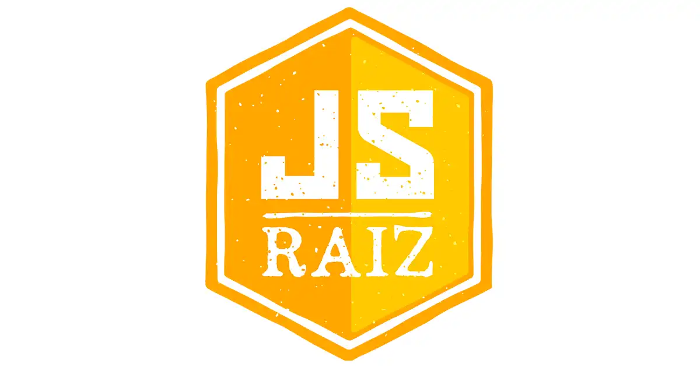
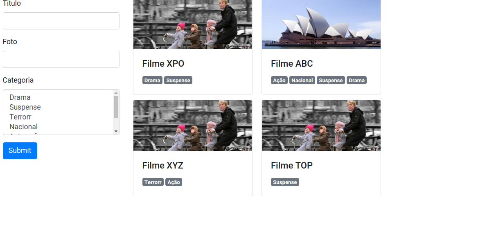

# Semana JavaScript Raiz

####Porque eu utilizo React em minhas aplicações? Porque não faço o que faço com JS puro? 🤔🤔
[I'm an inline-style link with title]

Essa pergunta feita por Ayrton Teshima dono do canal [Programador a Bordo](https://www.youtube.com/c/ProgramadoraBordo/featured) durante a segunda aula da Semana JavaScript Raiz e me fez parar e refletir o porque desenvolvo da forma que desenvolvo.

Apesar de estudar React a mais de um ano eu nunca tinha parado para pesquisar o porque o React foi criado e qual a dor que ele resolvia. Ao longo desta semana pude entender melhor o seu real proposito da biblioteca.

Durante a segunda aula, desenvolvemos uma aplicação bem simples para entender como a reatividade conceito muito presente no desenvolvimento web moderno, em suma reatividade funcionalidade de renderizar um componente quando o valor de seu estado é alterado. Durante a segunda aula desenvolvemos uma aplicação de cadastro de filmes bem simples utilizando HTML, Bootstrap e o bom e velho JavaScript.

Mesmo sendo uma aplicação simples deu pra absorver muito conhecimento sobre JS além de entender melhor o como esses frameworks funcionam por debaixo dos panos.

**Anotações no Notion**
https://lnkd.in/dthv-RG

## Captura de tela

